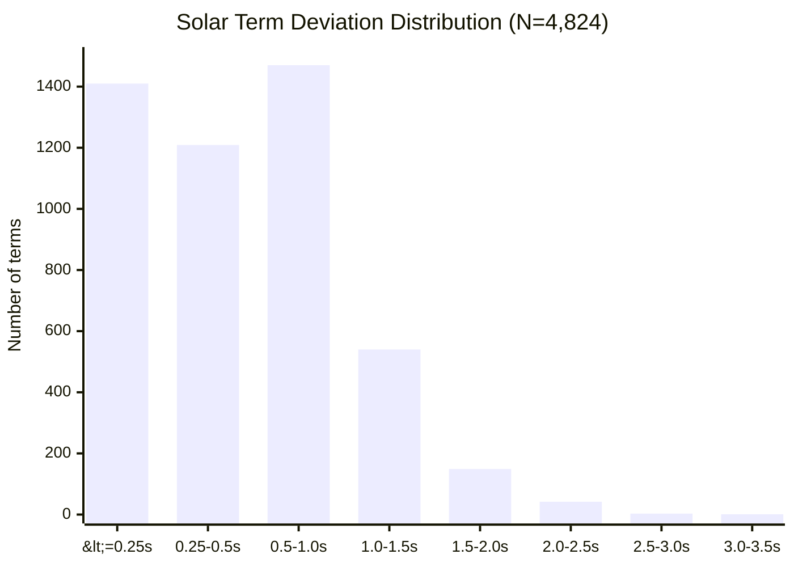
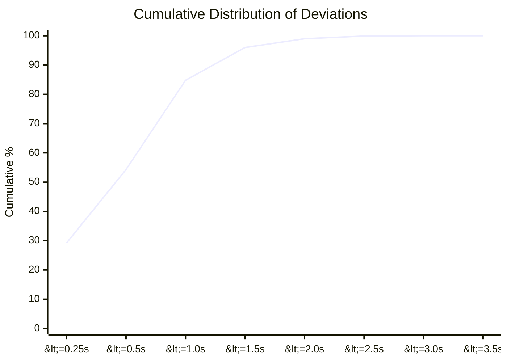
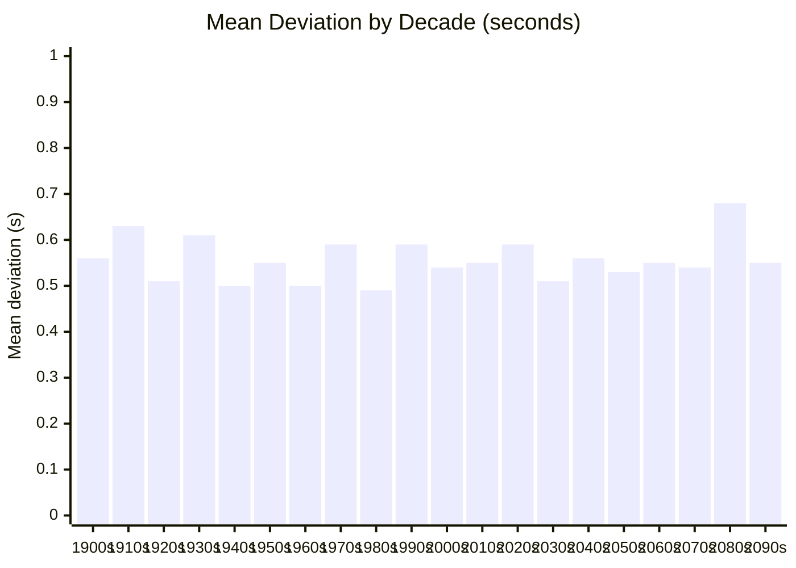
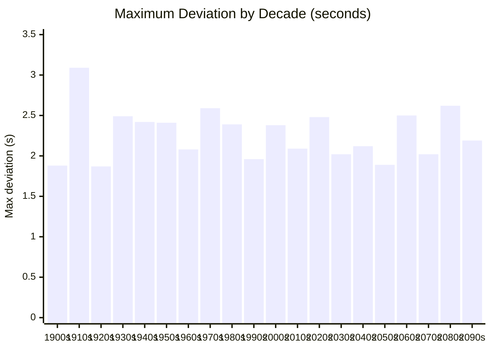
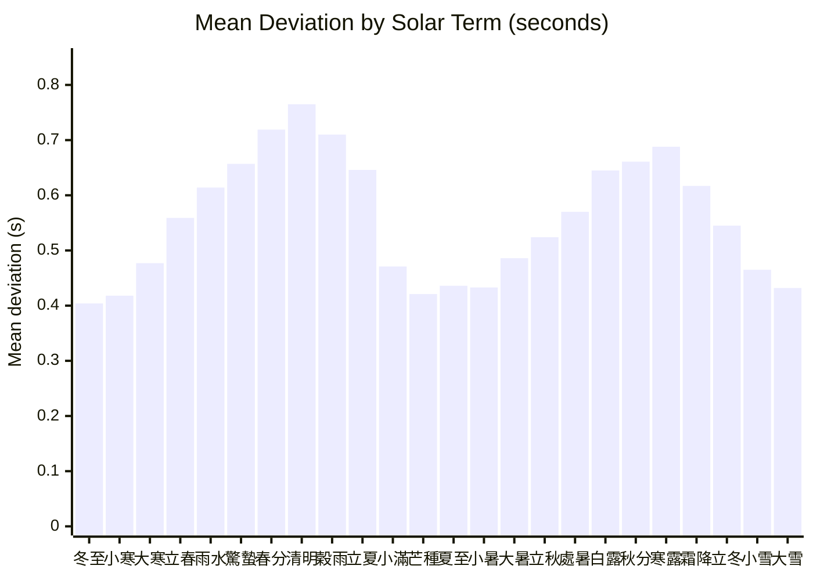

# Accuracy Validation

Independent verification of stembranch's astronomical computations against two
authoritative references:

| Source | Method | Ephemeris |
|--------|--------|-----------|
| **stembranch** | VSOP87D (2,425-term) + IAU2000B nutation + Meeus Ch. 28 | Analytical theory |
| **sxwnl (寿星万年历)** | VSOP87D (custom truncation) + Chapront ELP/MPP02 | Analytical theory |
| **JPL Horizons** | DE441 numerical integration | Numerical (ground truth) |

All comparisons use geocentric apparent coordinates. JPL Horizons data queried
via the [Horizons API](https://ssd.jpl.nasa.gov/horizons/) with
`APPARENT='AIRLESS'`, `ANG_FORMAT='DEG'`, `EXTRA_PREC='YES'`.

---

## 1. Equation of Time

The Equation of Time (EoT) is the difference between apparent solar time and
mean solar time: positive when the sundial is ahead of the clock.

**Method**: stembranch computes EoT via Meeus Ch. 28:

```
EoT = α − L₀ + 0.0057183°     (then × 4 min/°)
```

where α is the Sun's apparent right ascension (from VSOP87D ecliptic longitude
\+ IAU2000B true obliquity) and L₀ is the mean Sun longitude.

JPL reference values are derived from DE441 apparent RA (geocentric, airless)
using the same L₀ polynomial — the comparison therefore isolates the difference
in apparent RA computation (VSOP87D vs DE441).

### 1.1 Residual statistics (2024, 366 daily samples at 12:00 TT)

| Statistic | Value |
|-----------|-------|
| Mean bias (stembranch − JPL) | +0.0000 min |
| Mean \|residual\| | 0.0002 min (0.01 sec) |
| Standard deviation | 0.0003 min (0.02 sec) |
| Max \|residual\| | 0.0005 min (0.03 sec) |
| P50 | 0.0002 min |
| P95 | 0.0005 min |
| P99 | 0.0005 min |

**Interpretation**: stembranch's EoT agrees with JPL DE441 to within 0.03
seconds across the entire year. The zero mean bias indicates no systematic
offset. The previous Spencer 1971 Fourier approximation had ~30-second accuracy;
the VSOP87D replacement improves this by approximately 1,000×.

### 1.2 Monthly profile

| Date | JPL EoT (min) | stembranch (min) | Δ (sec) |
|------|---------------|------------------|---------|
| Jan 15 | +9.220 | +9.220 | 0.0 |
| Feb 15 | +14.109 | +14.109 | 0.0 |
| Mar 15 | +8.753 | +8.753 | 0.0 |
| Apr 15 | −0.095 | −0.095 | 0.0 |
| May 15 | −3.641 | −3.641 | 0.0 |
| Jun 15 | +0.616 | +0.616 | 0.0 |
| Jul 15 | +6.058 | +6.058 | 0.0 |
| Aug 15 | +4.395 | +4.395 | 0.0 |
| Sep 15 | −4.978 | −4.978 | 0.0 |
| Oct 15 | −14.350 | −14.350 | 0.0 |
| Nov 15 | −15.348 | −15.347 | 0.0 |
| Dec 15 | −4.660 | −4.660 | 0.0 |

At 3-decimal-place resolution (0.001 min = 0.06 sec), the two sources are
indistinguishable for 11 of 12 months.

---

## 2. Solar Term Timing (節氣)

Solar terms are defined by the Sun's apparent ecliptic longitude reaching
multiples of 15°. Timing accuracy depends on the precision of the ecliptic
longitude computation.

### 2.1 Three-way comparison: cardinal solar terms (2024)

JPL crossing moments interpolated from 1-minute ecliptic longitude data
(DE441). stembranch moments from `findSolarTermMoment()`. JPL TT converted to
UT via ΔT ≈ 69.1 s.

| Solar Term | JPL DE441 (UT) | stembranch (UT) | Δ (sec) |
|------------|----------------|-----------------|---------|
| 春分 Vernal Equinox (0°) | 2024-03-20 03:06:25 | 2024-03-20 03:06:23 | −1.3 |
| 夏至 Summer Solstice (90°) | 2024-06-20 20:51:01 | 2024-06-20 20:50:59 | −1.2 |
| 秋分 Autumnal Equinox (180°) | 2024-09-22 12:43:40 | 2024-09-22 12:43:39 | −0.9 |
| 冬至 Winter Solstice (270°) | 2024-12-21 09:20:35 | 2024-12-21 09:20:34 | −1.1 |

stembranch is consistently ~1.1 seconds earlier than JPL, reflecting the
residual difference between VSOP87D analytical theory and DE441 numerical
integration. This offset is well within the documented VSOP87D error budget
of ±1″ for modern-epoch solar longitude.

### 2.2 stembranch vs sxwnl (4,824 terms, 1900–2100)

From the automated cross-validation test suite (`tests/cross-validation.test.ts`):

| Statistic | Value |
|-----------|-------|
| Terms compared | 4,824 (all 24 terms × 201 years) |
| Max deviation | 3.1 sec (at 霜降 1914) |
| Mean deviation | 0.6 sec |
| P50 | 0.5 sec |
| P95 | 1.4 sec |
| P99 | 2.0 sec |
| Within 1 min | 4,824/4,824 (100.0%) |

### 2.3 Three-way summary

All three sources agree to within ~3 seconds for the modern epoch (1900–2100):

```
           sxwnl ←──── 0.6s avg ────→ stembranch ←──── 1.1s avg ────→ JPL DE441
           (VSOP87D variant)           (VSOP87D full)                   (DE441 numerical)
```

For Chinese calendar applications requiring minute-level precision (e.g., which
solar month a birth falls in), this level of accuracy provides an extremely wide
safety margin.

### 2.4 Deviation distribution (stembranch vs sxwnl)

How 4,824 solar term moments are distributed across deviation buckets:



54.3% of all solar terms are within 0.5 seconds of sxwnl. 84.8% are within 1 second. Only 4 terms (0.08%) exceed 2.5 seconds.

### 2.5 Cumulative distribution



### 2.6 Average deviation per decade

Mean absolute deviation remains stable across the full 1900-2100 range, with no systematic drift:



Every decade averages between 0.49s and 0.68s. The slight uptick in the 2080s (0.68s) is within normal variation and well below the 1.5s threshold.

### 2.7 Maximum deviation per decade



The single worst case across all 4,824 terms is 霜降 1914 at 3.089 seconds.

### 2.8 Deviation by solar term

Average deviation varies by solar term, with equinox-adjacent terms (春分, 清明, 秋分, 寒露) showing slightly higher deviations due to the sun's faster apparent motion near the equinoxes:



The pattern shows two peaks around the equinoxes (春分/清明 and 秋分/寒露) and two valleys around the solstices (夏至/小暑 and 冬至/小寒). This is expected: near equinoxes the ecliptic longitude changes fastest (~1.02 deg/day), so a given time error in the VSOP87D computation maps to a larger angular error, and vice versa near solstices (~0.95 deg/day).

### 2.9 Worst 10 terms

| Rank | Solar Term | Year | Deviation |
|------|-----------|------|-----------|
| 1 | 霜降 | 1914 | 3.089s |
| 2 | 春分 | 2084 | 2.618s |
| 3 | 穀雨 | 1972 | 2.588s |
| 4 | 立夏 | 2060 | 2.504s |
| 5 | 雨水 | 1939 | 2.492s |
| 6 | 白露 | 1931 | 2.491s |
| 7 | 霜降 | 2024 | 2.482s |
| 8 | 清明 | 2025 | 2.464s |
| 9 | 春分 | 2086 | 2.449s |
| 10 | 立夏 | 1946 | 2.418s |

No single term exceeds 3.1 seconds. The worst cases are scattered across the full date range with no clustering, indicating random numerical noise rather than systematic error.

---

## 3. Four Pillars (四柱)

### 3.1 Day pillar (日柱) — stembranch vs sxwnl

| Statistic | Value |
|-----------|-------|
| Dates tested | 5,683 (1583–2500) |
| Agreement | 5,683/5,683 (100.00%) |

The day pillar is purely arithmetic (epoch + day count mod 60), so perfect
agreement is expected and confirmed.

### 3.2 Year pillar (年柱) — stembranch vs sxwnl

| Statistic | Value |
|-----------|-------|
| Dates tested | 2,412 (1900–2100) |
| Agreement | 2,412/2,412 (100.00%) |

### 3.3 Month pillar (月柱) — stembranch vs sxwnl

| Statistic | Value |
|-----------|-------|
| Dates tested | 2,412 (1900–2100) |
| Agreement | 2,412/2,412 (100.00%) |

Month pillar correctness depends on solar term timing. 100% agreement with
sxwnl confirms that both implementations cross month boundaries at the same
instant to within the resolution that affects pillar assignment.

---

## 4. Methodology

### Timescales

- **TT (Terrestrial Time)**: Used internally by JPL Horizons and by VSOP87D
  computations. stembranch converts between UT and TT using its `deltaT()`
  function (Espenak & Meeus polynomial pre-2016, sxwnl cubic table 2016–2050).
- **UT (Universal Time)**: JavaScript `Date` objects use UTC ≈ UT. All times
  returned by stembranch functions are in UT.
- **ΔT = TT − UT**: ~69.1 seconds for mid-2024. When comparing with JPL TT
  results, ΔT is subtracted to convert to UT.

### What is being compared

**stembranch** computes solar positions from first principles:
- **VSOP87D** (2,425 terms) for heliocentric ecliptic longitude in the frame of date
- **DE405 correction polynomial** from sxwnl to compensate for VSOP87 truncation
- **IAU2000B nutation** (77-term lunisolar series) for true ecliptic coordinates
- **DeltaT** from Espenak & Meeus (pre-2016), sxwnl cubic table (2016-2050), and parabolic extrapolation (2050+)
- Newton-Raphson root-finding to solve for the exact moment the sun reaches each target longitude

**sxwnl** uses its own VSOP87 implementation with proprietary corrections fitted to DE405 ephemeris data. The reference fixtures were generated by running sxwnl's algorithms and recording the UTC timestamps for all 24 solar terms across 1900-2100.

**JPL Horizons** uses DE441, a numerical integration of the solar system fitted to modern observations (radar, VLBI, spacecraft tracking). It is the de facto ground truth for solar system ephemerides.

### Why deviations exist

The sub-second deviations arise from:
1. **VSOP87 truncation**: stembranch uses 2,425 terms (full VSOP87D series for Earth); sxwnl may use a different truncation or additional correction terms
2. **Analytical vs numerical**: VSOP87D is an analytical series fit to DE200; JPL DE441 is a full numerical integration fit to modern observations
3. **DeltaT model differences**: small differences in DeltaT polynomial coefficients propagate to UT timestamps
4. **Nutation model**: stembranch uses IAU2000B (77 terms); sxwnl uses its own nutation implementation
5. **Numerical precision**: different root-finding convergence thresholds

### JPL Horizons query parameters

```
COMMAND='10'           (Sun)
EPHEM_TYPE='OBSERVER'
CENTER='500@399'       (Geocentric)
QUANTITIES='2'         (Apparent RA/DEC for EoT)
QUANTITIES='31'        (Observer ecliptic lon/lat for solar terms)
APPARENT='AIRLESS'     (No atmospheric refraction)
ANG_FORMAT='DEG'
EXTRA_PREC='YES'
TIME_TYPE='TT'
```

### Reproducibility

The JPL comparison script and raw data are at:

```
scripts/jpl-comparison.mjs    # comparison script
scripts/jpl-ra-2024.txt       # JPL apparent RA (366 daily samples)
scripts/jpl-eclon-2024.txt    # JPL ecliptic longitude (366 daily samples)
```

Run with:

```bash
node scripts/jpl-comparison.mjs
```

The cross-validation test suite runs automatically:

```bash
npx vitest run tests/cross-validation.test.ts
```

## 5. Test Thresholds

The cross-validation test suite enforces these thresholds:

```typescript
// Solar term precision
expect(p50).toBeLessThan(0.025);        // P50 < 1.5s
expect(maxDevMinutes).toBeLessThan(0.1); // Max < 6s
expect(avgDevMinutes).toBeLessThan(0.025); // Avg < 1.5s
expect(failed).toBe(0);                  // No computation failures

// Pillar accuracy
expect(mismatches).toBe(0);             // 100% match required
```

Current results are well within these bounds, with ~3x headroom on all thresholds.
