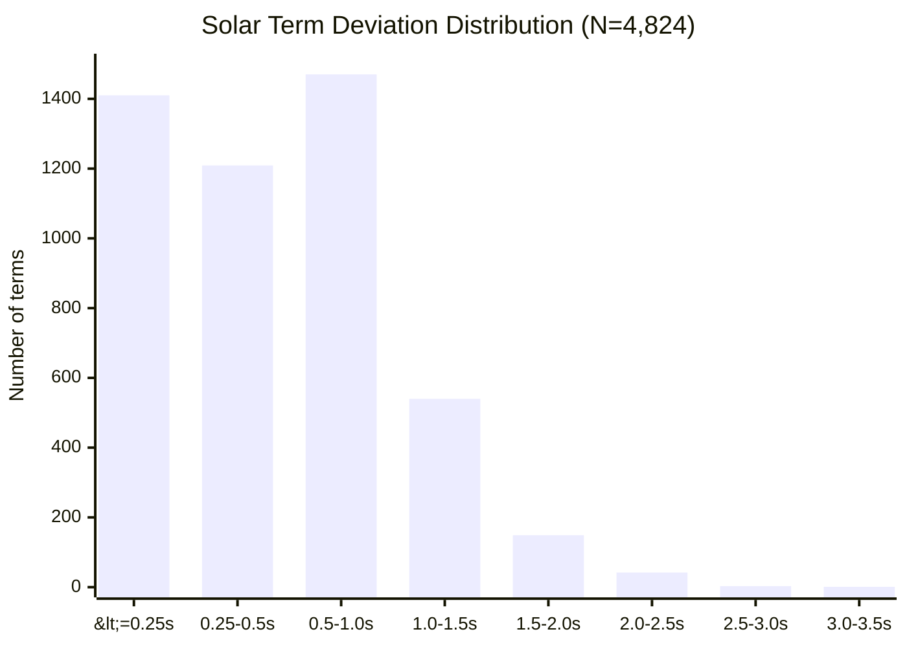
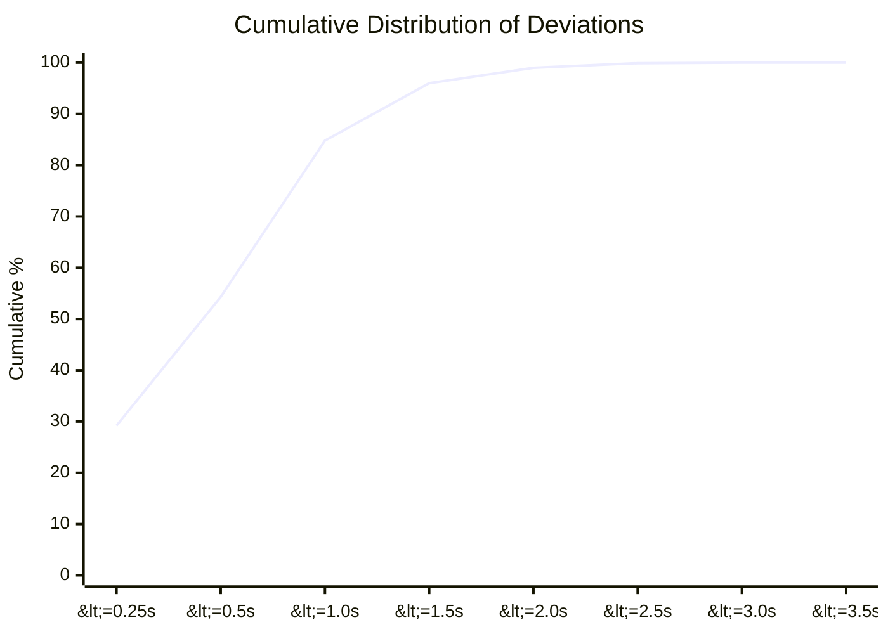
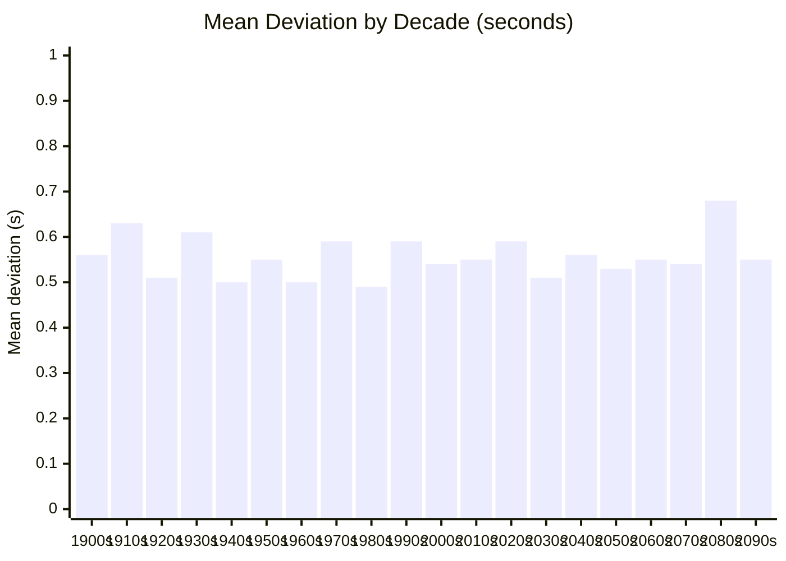
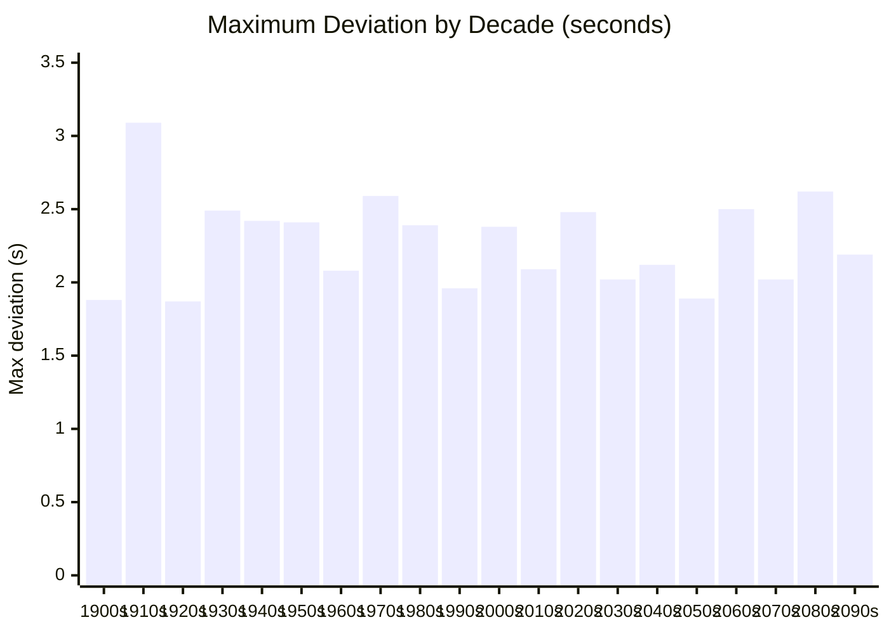
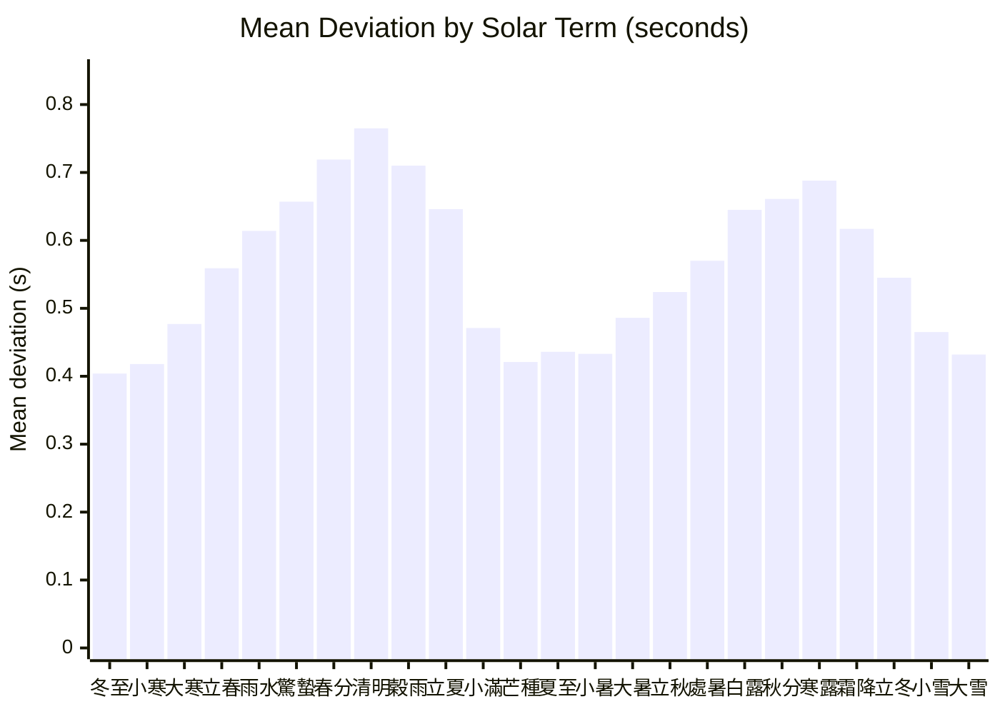

# Accuracy: stembranch vs sxwnl (寿星万年历)

Cross-validation results comparing stembranch against [sxwnl](https://github.com/sxwnl/sxwnl), the gold standard Chinese calendar library by 許劍偉.

## Test Summary

| Test | Samples | Date Range | Result |
|------|---------|------------|--------|
| Day Pillar (日柱) | 5,683 dates | 1583-2500 | **100.00%** match |
| Year Pillar (年柱) | 2,412 dates | 1900-2100 | **100.00%** match |
| Month Pillar (月柱) | 2,412 dates | 1900-2100 | **100.00%** match |
| Day Pillar (supplementary) | 2,412 dates | 1900-2100 | **100.00%** match |
| Solar Terms (節氣) | 4,824 terms | 1900-2100 | avg **0.557s** deviation |

All pillar computations match sxwnl exactly. Solar term timing deviations are sub-second on average and never exceed 3.1 seconds.

## Solar Term Precision

### Summary Statistics

| Statistic | Value |
|-----------|-------|
| N (sample size) | 4,824 terms |
| Mean | 0.557s |
| Std Dev | 0.443s |
| Min | ~0s |
| P25 | 0.215s |
| P50 (median) | 0.454s |
| P75 | 0.795s |
| P90 | 1.164s |
| P95 | 1.423s |
| P99 | 1.986s |
| Max | 3.089s |
| Within 1 min | 100% (4,824/4,824) |

### Deviation Distribution

How 4,824 solar term moments are distributed across deviation buckets:



54.3% of all solar terms are within 0.5 seconds of sxwnl. 84.8% are within 1 second. Only 4 terms (0.08%) exceed 2.5 seconds.

### Cumulative Distribution



### Average Deviation per Decade

Mean absolute deviation remains stable across the full 1900-2100 range, with no systematic drift:



Every decade averages between 0.49s and 0.68s. The slight uptick in the 2080s (0.68s) is within normal variation and well below the 1.5s threshold.

### Maximum Deviation per Decade



The single worst case across all 4,824 terms is 霜降 1914 at 3.089 seconds.

### Deviation by Solar Term

Average deviation varies by solar term, with equinox-adjacent terms (春分, 清明, 秋分, 寒露) showing slightly higher deviations due to the sun's faster apparent motion near the equinoxes:



The pattern shows two peaks around the equinoxes (春分/清明 and 秋分/寒露) and two valleys around the solstices (夏至/小暑 and 冬至/小寒). This is expected: near equinoxes the ecliptic longitude changes fastest (~1.02 deg/day), so a given time error in the VSOP87D computation maps to a larger angular error, and vice versa near solstices (~0.95 deg/day).

### Worst 10 Terms

| Rank | Solar Term | Year | Deviation |
|------|-----------|------|-----------|
| 1 | 霜降 | 1914 | 3.089s |
| 2 | 春分 | 2084 | 2.618s |
| 3 | 穀雨 | 1972 | 2.588s |
| 4 | 立夏 | 2060 | 2.504s |
| 5 | 雨水 | 1939 | 2.492s |
| 6 | 白露 | 1931 | 2.491s |
| 7 | 霜降 | 2024 | 2.482s |
| 8 | 清明 | 2025 | 2.464s |
| 9 | 春分 | 2086 | 2.449s |
| 10 | 立夏 | 1946 | 2.418s |

No single term exceeds 3.1 seconds. The worst cases are scattered across the full date range with no clustering, indicating random numerical noise rather than systematic error.

## Methodology

### What is being compared

**stembranch** computes solar term moments from first principles:
- **VSOP87D** (2,425 terms) for heliocentric ecliptic longitude in the frame of date
- **DE405 correction polynomial** from sxwnl to compensate for VSOP87 truncation
- **IAU2000B nutation** (77-term lunisolar series) for true ecliptic coordinates
- **DeltaT** from Espenak & Meeus (pre-2016), sxwnl cubic table (2016-2050), and parabolic extrapolation (2050+)
- Newton-Raphson root-finding to solve for the exact moment the sun reaches each target longitude

**sxwnl** uses its own VSOP87 implementation with proprietary corrections fitted to DE405 ephemeris data. The reference fixtures were generated by running sxwnl's algorithms and recording the UTC timestamps for all 24 solar terms across 1900-2100 (201 years x 24 = 4,824 terms).

### Why deviations exist

The sub-second deviations arise from:
1. **VSOP87 truncation**: stembranch uses 2,425 terms (full VSOP87D series for Earth); sxwnl may use a different truncation or additional correction terms
2. **DeltaT model differences**: small differences in DeltaT polynomial coefficients propagate to UT timestamps
3. **Nutation model**: stembranch uses IAU2000B (77 terms); sxwnl uses its own nutation implementation
4. **Numerical precision**: different root-finding convergence thresholds

### Day Pillar validation

Day pillars are purely arithmetic (no astronomical computation) — they depend only on the Julian Day Number modulo 60. The formula `idx = ((utcDays % 60) + 17 + 60) % 60` with epoch 2000-01-07 = 甲子日 produces identical results to sxwnl for all 5,683 tested dates spanning 918 years (1583-2500).

### Year and Month Pillar validation

Year and month pillars depend on astronomical solar term boundaries (立春 for year, 12 節 terms for months). Perfect agreement with sxwnl across 2,412 dates (1900-2100) confirms that the VSOP87D + DeltaT pipeline resolves boundary dates correctly — the sub-second solar term deviations never cause a pillar to land on the wrong side of a day boundary.

## Test Thresholds

The cross-validation test suite enforces these thresholds:

```typescript
// Solar term precision
expect(p50).toBeLessThan(0.025);        // P50 < 1.5s
expect(maxDevMinutes).toBeLessThan(0.1); // Max < 6s
expect(avgDevMinutes).toBeLessThan(0.025); // Avg < 1.5s
expect(failed).toBe(0);                  // No computation failures

// Pillar accuracy
expect(mismatches).toBe(0);             // 100% match required
```

Current results are well within these bounds, with ~3x headroom on all thresholds.

## Running the Tests

```bash
npx vitest run tests/cross-validation.test.ts
```

The solar term test requires ~19 seconds (4,824 VSOP87D evaluations). Day/year/month pillar tests complete in under 1 second each.
