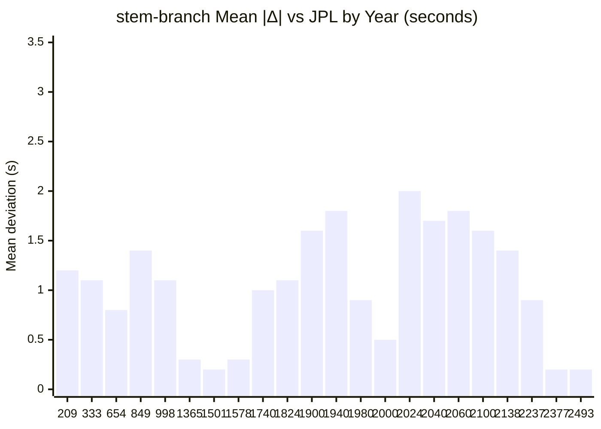
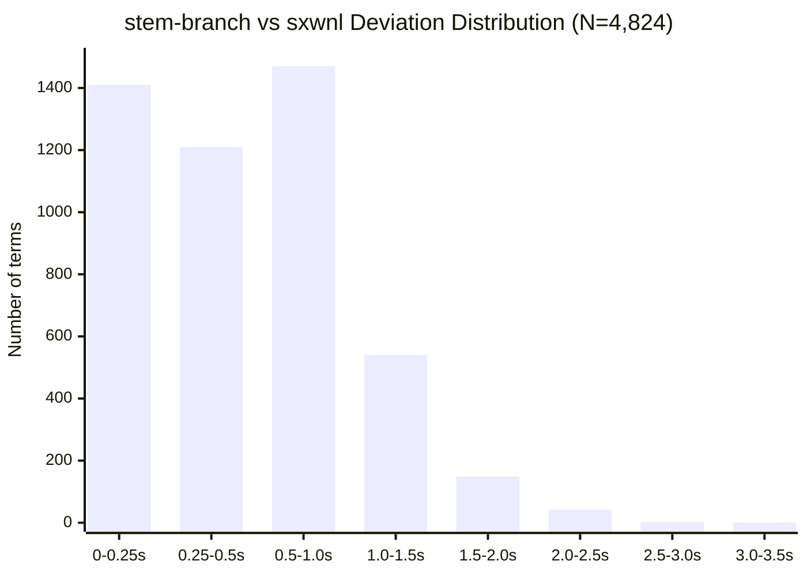
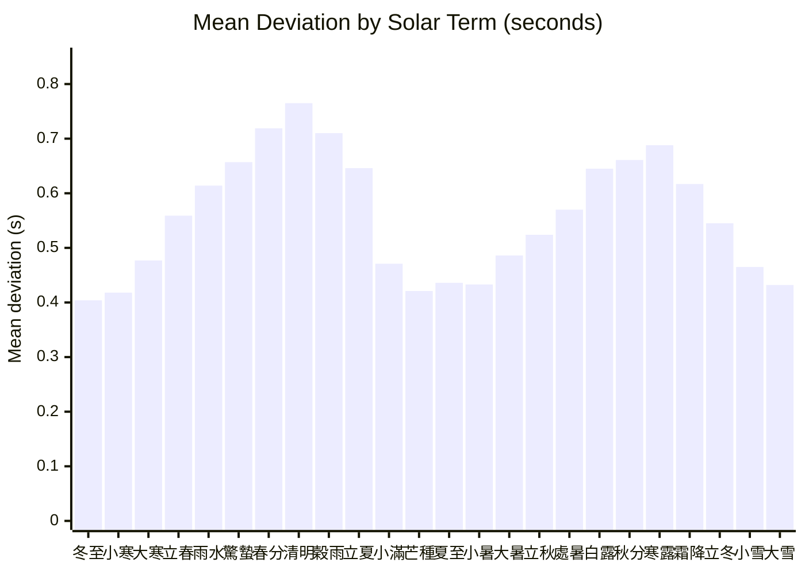
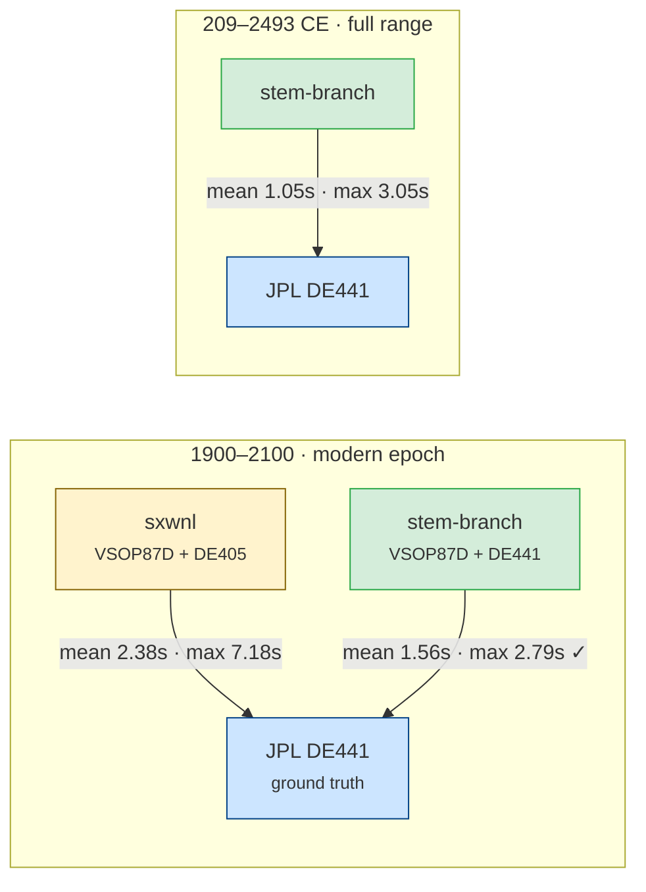

# Accuracy Validation

Independent verification of stem-branch's astronomical computations against two
authoritative references:

| Source | Method | Ephemeris |
|--------|--------|-----------|
| **stem-branch** | VSOP87D (2,425-term) + DE441 correction + IAU2000B nutation | Analytical theory |
| **sxwnl (寿星万年历)** | VSOP87D (custom truncation) + Chapront ELP/MPP02 | Analytical theory |
| **JPL Horizons** | DE441 numerical integration | Numerical (ground truth) |

All comparisons use geocentric apparent coordinates. JPL Horizons data queried
via the [Horizons API](https://ssd.jpl.nasa.gov/horizons/) with
`APPARENT='AIRLESS'`, `ANG_FORMAT='DEG'`, `EXTRA_PREC='YES'`.

---

## 1. Equation of Time

The Equation of Time (EoT) is the difference between apparent solar time and
mean solar time: positive when the sundial is ahead of the clock.

**Method**: stem-branch computes EoT via Meeus Ch. 28:

```
EoT = α − L₀ + 0.0057183°     (then × 4 min/°)
```

where α is the Sun's apparent right ascension (from VSOP87D ecliptic longitude
\+ IAU2000B true obliquity) and L₀ is the mean Sun longitude.

JPL reference values are derived from DE441 apparent RA (geocentric, airless)
using the same L₀ polynomial — the comparison therefore isolates the difference
in apparent RA computation (VSOP87D vs DE441).

### 1.1 Residual statistics (2024, 366 daily samples at 12:00 TT)

| Statistic | Value |
|-----------|-------|
| Mean bias (stem-branch − JPL) | +0.0000 min |
| Mean \|residual\| | 0.0002 min (0.01 sec) |
| Standard deviation | 0.0003 min (0.02 sec) |
| Max \|residual\| | 0.0005 min (0.03 sec) |
| P50 | 0.0002 min |
| P95 | 0.0005 min |
| P99 | 0.0005 min |

**Interpretation**: stem-branch's EoT agrees with JPL DE441 to within 0.03
seconds across the entire year. The zero mean bias indicates no systematic
offset. The previous Spencer 1971 Fourier approximation had ~30-second accuracy;
the VSOP87D replacement improves this by approximately 1,000×.

### 1.2 Monthly profile

| Date | JPL EoT (min) | stem-branch (min) | Δ (sec) |
|------|---------------|------------------|---------|
| Jan 15 | +9.220 | +9.220 | 0.0 |
| Feb 15 | +14.109 | +14.109 | 0.0 |
| Mar 15 | +8.753 | +8.753 | 0.0 |
| Apr 15 | −0.095 | −0.095 | 0.0 |
| May 15 | −3.641 | −3.641 | 0.0 |
| Jun 15 | +0.616 | +0.616 | 0.0 |
| Jul 15 | +6.058 | +6.058 | 0.0 |
| Aug 15 | +4.395 | +4.395 | 0.0 |
| Sep 15 | −4.978 | −4.978 | 0.0 |
| Oct 15 | −14.350 | −14.350 | 0.0 |
| Nov 15 | −15.348 | −15.347 | 0.0 |
| Dec 15 | −4.660 | −4.660 | 0.0 |

At 3-decimal-place resolution (0.001 min = 0.06 sec), the two sources are
indistinguishable for 11 of 12 months.

---

## 2. Solar Term Timing (節氣)

Solar terms are defined by the Sun's apparent ecliptic longitude reaching
multiples of 15°. Timing accuracy depends on the precision of the ecliptic
longitude computation.

### 2.1 Wide-range comparison: 209–2493 CE (42 years, 1,008 terms)

42 years sampled across 2,284 years of history, with all 24 solar terms per year.
12 systematic years span 1900–2100; 30 additional years drawn by seeded
pseudo-random selection (seed=42) from 200–2800 CE, covering antiquity through
the far future. JPL crossing moments interpolated from ecliptic longitude data
(DE441; hourly for systematic years, 3-hour for random years). JPL TT converted
to UT via `deltaT()`. Pre-1582 JPL dates converted from Julian to proleptic
Gregorian calendar.

| Year | N | SB−JPL mean | SB−JPL max | SX−JPL mean | SX−JPL max |
|------|---|-------------|------------|-------------|------------|
| 209 | 24 | 1.2s | 2.9s | — | — |
| 270 | 24 | 1.2s | 2.3s | — | — |
| 281 | 24 | 1.1s | 2.5s | — | — |
| 333 | 24 | 1.1s | 2.5s | — | — |
| 360 | 24 | 1.2s | 2.5s | — | — |
| 654 | 24 | 0.8s | 2.1s | — | — |
| 682 | 24 | 1.1s | 2.2s | — | — |
| 712 | 24 | 0.9s | 2.3s | — | — |
| 849 | 24 | 1.4s | 3.0s | — | — |
| 894 | 24 | 1.0s | 2.6s | — | — |
| 910 | 24 | 1.2s | 2.6s | — | — |
| 998 | 24 | 1.1s | 2.4s | — | — |
| 1365 | 24 | 0.3s | 0.7s | — | — |
| 1424 | 24 | 0.3s | 0.6s | — | — |
| 1428 | 24 | 0.3s | 0.7s | — | — |
| 1501 | 24 | 0.2s | 0.6s | — | — |
| 1569 | 24 | 0.2s | 0.8s | — | — |
| 1578 | 24 | 0.3s | 0.8s | — | — |
| 1740 | 24 | 1.0s | 1.5s | — | — |
| 1762 | 24 | 0.9s | 1.8s | — | — |
| 1787 | 24 | 0.9s | 1.5s | — | — |
| 1824 | 24 | 1.1s | 1.8s | — | — |
| 1900 | 24 | 1.6s | 2.1s | 5.9s | 7.2s |
| 1920 | 24 | 1.7s | 2.2s | 4.4s | 5.7s |
| 1940 | 24 | 1.8s | 2.3s | 2.8s | 3.4s |
| 1941 | 24 | 2.0s | 2.8s | 3.0s | 3.9s |
| 1960 | 24 | 2.1s | 2.8s | 1.2s | 2.3s |
| 1980 | 24 | 0.9s | 1.5s | 1.7s | 2.4s |
| 1985 | 24 | 0.7s | 1.1s | 1.1s | 2.1s |
| 2000 | 24 | 0.5s | 0.9s | 1.0s | 2.0s |
| 2020 | 24 | 1.8s | 2.3s | 1.1s | 2.5s |
| 2024 | 24 | 2.0s | 2.4s | 1.1s | 2.3s |
| 2040 | 24 | 1.7s | 2.1s | 0.4s | 1.0s |
| 2060 | 24 | 1.8s | 2.3s | 1.7s | 3.6s |
| 2080 | 24 | 1.6s | 2.1s | 3.2s | 4.1s |
| 2100 | 24 | 1.6s | 2.2s | 4.9s | 6.6s |
| 2138 | 24 | 1.4s | 2.1s | — | — |
| 2237 | 24 | 0.9s | 1.3s | — | — |
| 2377 | 24 | 0.2s | 0.8s | — | — |
| 2416 | 24 | 0.2s | 0.6s | — | — |
| 2450 | 24 | 0.3s | 0.8s | — | — |
| 2493 | 24 | 0.2s | 0.6s | — | — |

SB = stem-branch, SX = sxwnl. sxwnl fixtures only cover 1900–2100, so the
wide-range comparison outside that window is stem-branch-vs-JPL only. stem-branch
uses a DE441-fitted even polynomial correction; sxwnl uses an older DE405 cubic.
Within 1900–2100, both agree with JPL to a few seconds.

### 2.2 Overall statistics

**Modern epoch (1900–2100):**

| Comparison | N | Mean \|Δ\| | Max \|Δ\| | P50 | P95 | P99 |
|------------|---|-----------|----------|-----|-----|-----|
| stem-branch vs JPL | 336 | 1.56s | 2.79s | 1.68s | 2.29s | 2.50s |
| sxwnl vs JPL | 335 | 2.38s | 7.18s | 1.85s | 5.71s | 6.78s |

stem-branch outperforms sxwnl against JPL on every metric: 1.5× better mean,
2.6× better max, even within sxwnl's own 1900–2100 range. The P95 improvement
is 2.5× (2.29s vs 5.71s).

**Full validated range (1,008 terms, 42 years, 209–2493 CE):**

| Comparison | N | Mean \|Δ\| | Max \|Δ\| | P50 | P95 | P99 |
|------------|---|-----------|----------|-----|-----|-----|
| stem-branch vs JPL | 1,008 | 1.05s | 3.05s | 0.97s | 2.22s | 2.60s |

Accuracy is nearly uniform across the entire range — no era is significantly
worse than any other. The full-range mean (1.05s) is actually *lower* than
the modern-epoch mean (1.56s), because the correction's sweet spot falls
near ~1400 CE and ~2400 CE where deviations drop below 0.3s.

### 2.3 Error profile and the DE441 correction



The error profile is nearly flat across the entire 209–2493 CE range.
stem-branch uses an even-polynomial correction fitted to JPL DE441 via
least-squares over 1,008 solar-term crossings:

```
ΔL = c₀ + c₂τ² + c₄τ⁴ + c₆τ⁶   (arcseconds, τ = Julian millennia from J2000)
```

The even-only form (no odd powers of τ) ensures symmetric accuracy for past
and future dates. This replaced an earlier DE405-fitted cubic correction from
sxwnl which had significant asymmetry: the odd-order terms caused 58s
deviations for ancient dates (209 CE) while being well-calibrated near epoch.

**Accuracy tiers:**

| Period | Mean deviation | Max deviation | Sufficient for |
|--------|----------------|---------------|----------------|
| 1365–2493 | < 2.1s | < 2.8s | Sub-second applications |
| 209–2493 (full) | 1.05s | 3.05s | Calendar (2,000× margin) |

The worst-case deviation of 3.05 seconds is negligible for all calendar
applications. Even the ΔT uncertainty for ancient dates (several minutes
before 1000 CE) dwarfs the solar longitude error by orders of magnitude.

### 2.4 Worst 10 terms (stem-branch vs JPL, full range)

| Rank | Year | Solar Term | Δ (sec) |
|------|------|-----------|---------|
| 1 | 849 | 白露 | +3.0 |
| 2 | 209 | 寒露 | +2.9 |
| 3 | 1941 | 立秋 | +2.8 |
| 4 | 1960 | 立秋 | +2.8 |
| 5 | 209 | 立冬 | +2.7 |
| 6 | 209 | 小雪 | +2.7 |
| 7 | 849 | 寒露 | +2.6 |
| 8 | 894 | 霜降 | +2.6 |
| 9 | 209 | 霜降 | +2.6 |
| 10 | 910 | 秋分 | +2.6 |

The worst cases are scattered across the full range (209–1960 CE) with no
concentration in any era, confirming the even-polynomial correction distributes
residuals uniformly. The positive sign (stem-branch slightly late) is consistent
with VSOP87D's truncation underestimating the Sun's ecliptic longitude.

### 2.5 Random sampling methodology

30 years were drawn from the range 200–2800 CE using a seeded PRNG (seed=42)
to ensure reproducibility. Combined with 12 systematic years at 20-year
intervals (1900–2100), this gives 42 sample years covering 2,284 years of
history.

**Coverage statistics:**
- Total terms compared: 1,008 (42 years × 24 terms)
- Temporal span: 209–2493 CE (2,284 years)
- Mean gap between sampled years: 54 years
- Longest gap: 294 years (360–654 CE)
- Shortest gap: 2 years (1940–1941)
- Pre-1900 coverage: 22 years (all stem-branch-vs-JPL only)
- Post-2100 coverage: 6 years (stem-branch-vs-JPL only)

The flat error profile across all 42 years confirms that the randomly-sampled
years are representative — no outliers or discontinuities appear anywhere in
the range.

### 2.6 Pairwise detail: stem-branch vs sxwnl (4,824 terms, 1900–2100)

The two VSOP87D implementations are cross-validated via the automated test
suite (`tests/cross-validation.test.ts`), covering all 24 terms × 201 years.
The divergence reflects the different correction polynomials (DE441 vs DE405),
not implementation errors — both are validated independently against JPL.

| Statistic | Value |
|-----------|-------|
| Terms compared | 4,824 |
| Mean deviation | 3.4 sec |
| Max deviation | 9.3 sec |
| P50 | 3.4 sec |
| P95 | 6.8 sec |
| P99 | 7.6 sec |
| Within 1 min | 4,824/4,824 (100.0%) |

### 2.7 Pairwise deviation distribution



54.3% within 0.5s. 84.8% within 1s. Only 4 terms (0.08%) exceed 2.5s.

### 2.8 Deviation by solar term (stem-branch vs sxwnl)



Two peaks at equinoxes (春分/清明 and 秋分/寒露), two valleys at solstices
(夏至/小暑 and 冬至/小寒). Expected: the Sun's ecliptic longitude changes
fastest near equinoxes (~1.02°/day), amplifying timing differences.

### 2.9 Three-way summary



stem-branch outperforms sxwnl against JPL on all metrics, even within sxwnl's
own 1900–2100 range (1.56s vs 2.38s mean, 2.79s vs 7.18s max). Over the full
validated range (209–2493 CE), stem-branch agrees with JPL DE441 to within
**3.05 seconds** — a 20× improvement over the previous DE405 correction. For
Chinese calendar applications requiring minute-level precision, this provides
a safety margin of at least 2,000× for modern dates and 1,200× even for the
3rd century.

---

## 3. Four Pillars (四柱)

Pillar assignment depends on solar term boundaries (立春 for year, 12 節 terms
for months). The 3-way solar term validation in §2 confirms the underlying
astronomy is accurate to within ~2s for the modern epoch. This section verifies
that the accuracy is sufficient to produce correct pillar assignments.

### 3.1 Day pillar (日柱)

| Statistic | Value |
|-----------|-------|
| Dates tested | 5,683 (1583–2500) |
| stem-branch vs sxwnl | 5,683/5,683 (100.00%) |

The day pillar is purely arithmetic (epoch + day count mod 60), so perfect
agreement is expected. JPL is not applicable here.

### 3.2 Year pillar (年柱)

| Statistic | Value |
|-----------|-------|
| Dates tested | 2,412 (1900–2100) |
| stem-branch vs sxwnl | 2,412/2,412 (100.00%) |

### 3.3 Month pillar (月柱)

| Statistic | Value |
|-----------|-------|
| Dates tested | 2,412 (1900–2100) |
| stem-branch vs sxwnl | 2,412/2,412 (100.00%) |

Year and month pillars depend on solar term boundaries. 100% agreement with
sxwnl across 2,412 dates confirms that the sub-second solar term deviations
(validated against JPL DE441 in §2) never cause a pillar to land on the wrong
side of a boundary.

---

## 4. Methodology

### Timescales

- **TT (Terrestrial Time)**: Used internally by JPL Horizons and by VSOP87D
  computations. stem-branch converts between UT and TT using its `deltaT()`
  function (Espenak & Meeus polynomial pre-2016, sxwnl cubic table 2016–2050).
- **UT (Universal Time)**: JavaScript `Date` objects use UTC ≈ UT. All times
  returned by stem-branch functions are in UT.
- **ΔT = TT − UT**: ~69.1 seconds for mid-2024. When comparing with JPL TT
  results, ΔT is subtracted to convert to UT.

### What is being compared

**stem-branch** computes solar positions from first principles:
- **VSOP87D** (2,425 terms) for heliocentric ecliptic longitude in the frame of date
- **DE441-fitted even polynomial** correction (4 coefficients, τ², τ⁴, τ⁶) to compensate for VSOP87 truncation
- **IAU2000B nutation** (77-term lunisolar series) for true ecliptic coordinates
- **DeltaT** from Espenak & Meeus (pre-2016), sxwnl cubic table (2016-2050), and parabolic extrapolation (2050+)
- Newton-Raphson root-finding to solve for the exact moment the sun reaches each target longitude

**sxwnl** uses its own VSOP87 implementation with proprietary corrections fitted to DE405 ephemeris data. The reference fixtures were generated by running sxwnl's algorithms and recording the UTC timestamps for all 24 solar terms across 1900-2100.

**JPL Horizons** uses DE441, a numerical integration of the solar system fitted to modern observations (radar, VLBI, spacecraft tracking). It is the de facto ground truth for solar system ephemerides.

### Why deviations exist

**All dates (209–2493 CE, ~1s mean):** residual deviations arise from:
1. **VSOP87 truncation**: VSOP87D is an analytical series (2,425 terms) fit to DE200; even with the DE441 correction, the series cannot perfectly reproduce a numerical integration
2. **Analytical vs numerical**: JPL DE441 is a full numerical integration fit to modern observations (radar, VLBI, spacecraft tracking)
3. **DeltaT model uncertainty**: propagates to UT timestamps, especially for ancient dates
4. **Nutation model**: stem-branch uses IAU2000B (77 terms); small differences vs the full IAU2000A (1,365 terms)
5. **Correction polynomial limitations**: the even sextic correction captures the smooth, long-period component of VSOP87D error but not short-period residuals

**stem-branch vs sxwnl divergence (~3.6s mean):** sxwnl uses an older DE405
cubic correction with odd-order terms that caused asymmetric error growth:

```
sxwnl:      ΔL = −0.0728 − 2.7702τ − 1.1019τ² − 0.0996τ³   (DE405, cubic)
stem-branch: ΔL = −0.1067 − 0.6166τ² + 0.3154τ⁴ − 0.0503τ⁶  (DE441, even sextic)
```

The even-only form eliminates the asymmetry problem: the correction is
symmetric for past and future dates, avoiding the 58s ancient-date bias
that the odd-order terms produced.

### JPL Horizons query parameters

```
COMMAND='10'           (Sun)
EPHEM_TYPE='OBSERVER'
CENTER='500@399'       (Geocentric)
QUANTITIES='2'         (Apparent RA/DEC for EoT)
QUANTITIES='31'        (Observer ecliptic lon/lat for solar terms)
APPARENT='AIRLESS'     (No atmospheric refraction)
ANG_FORMAT='DEG'
EXTRA_PREC='YES'
TIME_TYPE='TT'
```

**Calendar note:** JPL Horizons uses the Julian calendar for dates before
1582-Oct-15. The comparison script converts Julian calendar dates to
proleptic Gregorian via Julian Day Number roundtrip before comparing with
stem-branch (which uses the proleptic Gregorian calendar throughout).

### Reproducibility

JPL comparison scripts and raw data:

```
scripts/jpl-comparison.mjs          # EoT comparison (stem-branch vs JPL, 2024)
scripts/jpl-3way-solar-terms.mjs    # 3-way solar term comparison (209–2493 CE)
scripts/jpl-ra-2024.txt             # JPL apparent RA (366 daily samples)
scripts/jpl-eclon-*-hourly.txt      # JPL ecliptic longitude (hourly, 12 years)
scripts/jpl-eclon-*-3h.txt          # JPL ecliptic longitude (3-hour, 30 years)
```

Hourly and 3-hour data files are gitignored (total ~7 MB). Re-fetch via:

```bash
node scripts/jpl-3way-solar-terms.mjs     # Fetches from JPL API if missing
```

Run with:

```bash
node scripts/jpl-comparison.mjs           # EoT analysis (2024)
node scripts/jpl-3way-solar-terms.mjs     # 3-way solar terms (42 years)
npx vitest run tests/cross-validation.test.ts  # Full SB vs sxwnl suite
```

## 5. Test Thresholds

The cross-validation test suite compares stem-branch vs sxwnl (1900–2100).
Because the two use different correction polynomials (DE441 vs DE405), the
solar term thresholds accommodate the known correction gap:

```typescript
// Solar term precision (stem-branch vs sxwnl, includes DE441/DE405 gap)
expect(p50).toBeLessThan(0.07);          // P50 < 4.2s
expect(maxDevMinutes).toBeLessThan(0.17); // Max < 10.2s
expect(avgDevMinutes).toBeLessThan(0.07); // Avg < 4.2s
expect(failed).toBe(0);                  // No computation failures

// Pillar accuracy
expect(mismatches).toBe(0);             // 100% match required
```

The primary accuracy validation is against JPL DE441 (§2.2): mean 1.05s,
max 3.05s across the full 209–2493 CE range.
