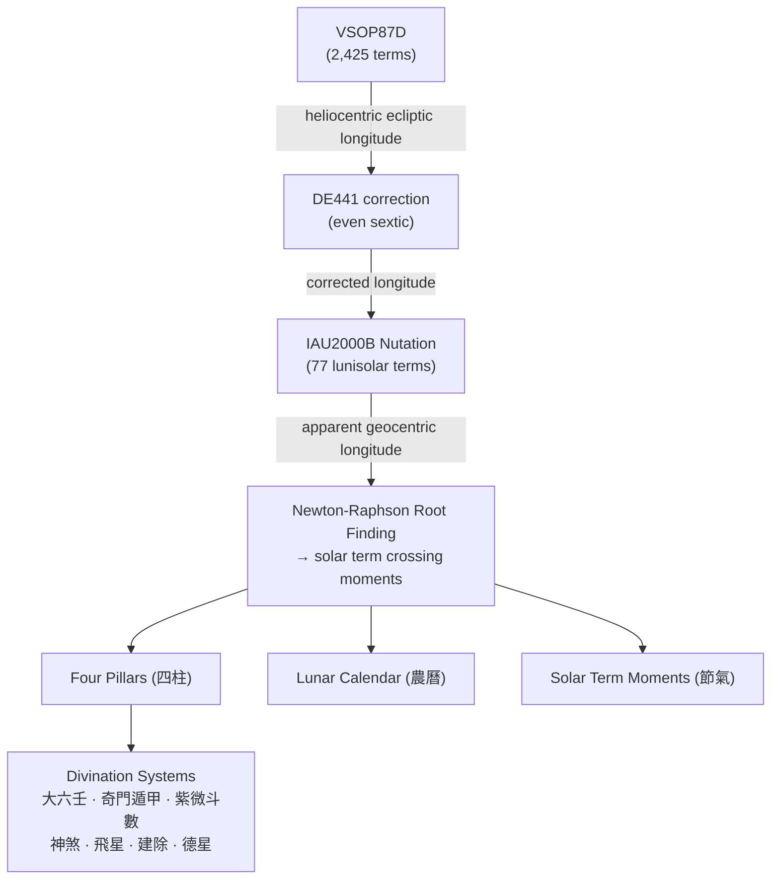

# Algorithm Overview

stembranch computes everything from first principles — no lookup tables for astronomical quantities. This page describes the major algorithm modules and how they connect.

## Architecture

## Module Inventory

### Astronomical Foundations

| Module | File | Description |
|--------|------|-------------|
| Solar Longitude | `solar-longitude.ts` | VSOP87D + DE441 correction + IAU2000B nutation |
| Solar Terms | `solar-terms.ts` | Newton-Raphson root finding for 24 節氣 |
| Lunar Calendar | `lunar.ts` | Meeus Ch. 49 new moons + solar term interpolation |
| Delta T | `delta-t.ts` | ΔT = TT - UT (Espenak & Meeus + sxwnl tables) |
| True Solar Time | `true-solar-time.ts` | Equation of Time via VSOP87D apparent RA |
| Eclipses | `eclipses.ts` | Solar/lunar eclipse detection |
| Julian Day | `julian-day.ts` | JDN conversions, Julian/Gregorian calendar |

### Calendar & Pillars

| Module | File | Description |
|--------|------|-------------|
| Four Pillars | `four-pillars.ts` | 年月日時 stem-branch assignment |
| Hidden Stems | `hidden-stems.ts` | 地支藏干 (hidden stems in branches) |
| Ten Relations | `ten-relations.ts` | 十神 (ten gods/relations between stems) |
| Branch Relations | `branch-relations.ts` | 六合/三合/六衝/三刑/六害/自刑 |
| Element Strength | `element-strength.ts` | 旺相休囚死 (seasonal element phases) |
| Luck Pillars | `luck-pillars.ts` | 大運/小運 (major/minor luck periods) |

### Almanac & Reference

| Module | File | Description |
|--------|------|-------------|
| Almanac Flags | `almanac-flags.ts` | 29 神煞 (spirit killers) |
| Day Fitness | `day-fitness.ts` | 建除十二神 (12-day cycle) |
| Virtue Stars | `virtue-stars.ts` | 天德/月德 and combinations |
| Deity Directions | `deity-directions.ts` | 財神/喜神/福神/貴神 directions |
| Flying Stars | `flying-stars.ts` | 九宮飛星 (9-palace flying stars) |
| Lunar Mansions | `lunar-mansions.ts` | 二十八宿 (28 lunar mansions) |

### Divination Systems

| Module | File | Description |
|--------|------|-------------|
| Six Ren | `six-ren.ts` | 大六壬 (Da Liu Ren) |
| Mystery Gates | `mystery-gates.ts` | 奇門遁甲 (Qi Men Dun Jia) |
| Zi Wei | `zi-wei.ts` | 紫微斗數 (Purple Star Astrology) |

## Key Design Principles

1. **No lookup tables for astronomy.** Solar terms are computed by solving for the Sun's ecliptic longitude reaching multiples of 15°. The solar longitude comes from evaluating the full VSOP87D series.

2. **Validated against JPL DE441.** The DE441 correction was fitted against 1,008 JPL Horizons data points spanning 209–2493 CE, achieving mean 1.05s / max 3.05s accuracy.

3. **Deterministic.** Given the same input date, the output is always the same. No randomness, no external state.

4. **Zero dependencies.** All astronomical constants, polynomial coefficients, and lookup tables are embedded in the source code.
