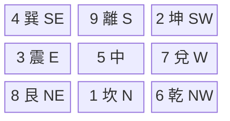
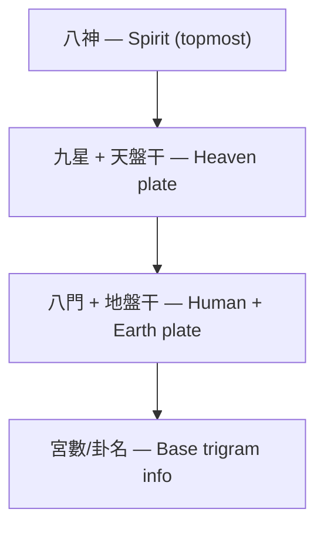
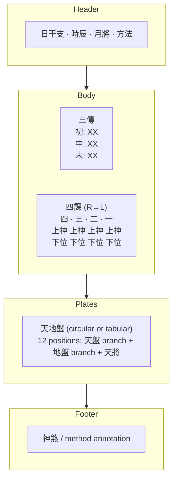
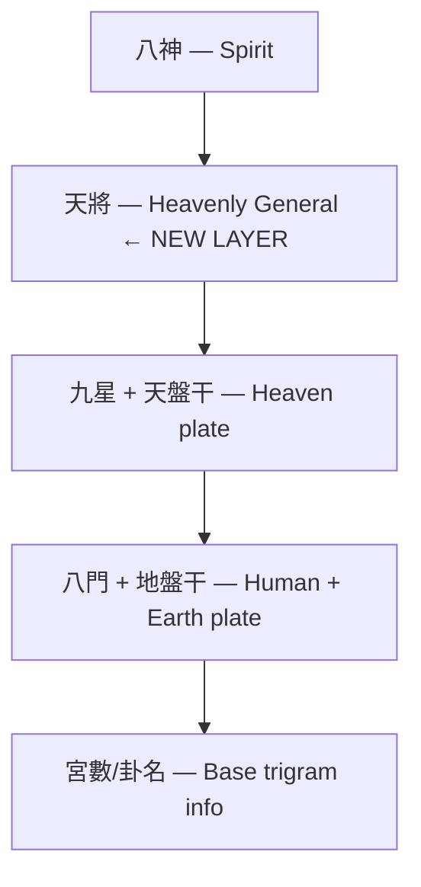

# Divination Systems Chart Display Research

Research on how Chinese metaphysics web applications display charts for
紫微斗數, 奇門遁甲, and 大六壬.

---

## 1. 紫微斗數 (Zi Wei Dou Shu / Purple Star Astrology)

### Visual Layout: 4x4 Grid with Hollow Center

The 命盤 (destiny chart) is universally rendered as a **4x4 CSS grid**
where the 12 outer cells are the 12 palaces and the center 2x2 area
displays birth information.

```mermaid
block-beta
  columns 4
  si["巳 (Si)"] wu["午 (Wu)"] wei["未 (Wei)"] shen["申 (Shen)"]
  chen["辰 (Chen)"] center["Center Info Area<br/>(birth data, 五行局, etc.)"]:2 you["酉 (You)"]
  mao["卯 (Mao)"] space[" "]:2 xu["戌 (Xu)"]
  yin["寅 (Yin)"] chou["丑 (Chou)"] zi["子 (Zi)"] hai["亥 (Hai)"]
```

Palaces are placed **anti-clockwise** starting from 命宮 (which varies
per person). The 12 earthly branches have **fixed grid positions**; the
palace names rotate based on computation.

### Palace Cell Content (per cell)

Each palace cell displays multiple data layers:

1. **Palace Name** (宮名): 命宮, 兄弟宮, 夫妻宮, 子女宮, 財帛宮,
   疾厄宮, 遷移宮, 僕役宮, 官祿宮, 田宅宮, 福德宮, 父母宮
2. **Heavenly Stem + Earthly Branch** (天干地支)
3. **Major Stars** (主星): 0-3 of the 14 main stars
   - 紫微, 天機, 太陽, 武曲, 天同, 廉貞, 天府, 太陰,
     貪狼, 巨門, 天相, 天梁, 七殺, 破軍
4. **Auxiliary Stars** (輔星/煞星/雜曜): 6 auspicious + 6 inauspicious + misc
5. **四化 Markers**: 祿/權/科/忌 attached to specific stars
6. **大限 Age Range** (e.g., "32-41")
7. **Star Brightness** (亮度): 廟/旺/得地/利/平/不得地/落陷

### Center Area Content

- Person's name, gender, birth date (solar + lunar)
- 五行局 (Five Element Bureau number)
- 命主/身主 stars
- 四柱 (Four Pillars)
- 三方四正 indicator lines (in react-iztro)

### CSS Implementation

```css
.zwds-chart {
  display: grid;
  grid-template-columns: repeat(4, 1fr);
  grid-template-rows: repeat(4, 1fr);
}
.center-info {
  grid-column: 2 / 4;
  grid-row: 2 / 4;
}
```

### Computation: Inputs to Outputs

- **Input**: Birth date (solar or lunar), birth hour (0-12 Chinese hours), gender
- **Output**: 12 palaces with all stars placed, 四化 assigned, 大限 ranges

### Open Source Reference Implementations

| Project | Language | Stars | Notes |
|---------|----------|-------|-------|
| [iztro](https://github.com/SylarLong/iztro) | TypeScript | 3.4k | Core computation library, `npm install iztro` |
| [react-iztro](https://github.com/SylarLong/react-iztro) | React+CSS | 487 | Ready-made React component (79% TS, 21% CSS) |
| [iztro-hook](https://github.com/SylarLong/iztro-hook) | React | — | Hook for custom rendering |
| [cubshuang/ZiWeiDouShu](https://github.com/cubshuang/ZiWeiDouShu) | HTML+JS+CSS | 73 | Simple single-page implementation |
| [fortel-ziweidoushu](https://github.com/airicyu/fortel-ziweidoushu) | JavaScript | — | 中州派 school |
| [py-iztro](https://github.com/x-haose/py-iztro) | Python | — | Python port of iztro |

Online demos: [ziwei.pub](https://ziwei.pub/), [aiioo.com](https://aiioo.com/),
[fate.windada.com](https://fate.windada.com/cgi-bin/fate)

---

## 2. 奇門遁甲 (Qi Men Dun Jia)

### Visual Layout: 3x3 Grid (九宮格)

Based on the Lo Shu magic square. Each cell contains 4-5 stacked layers
of information. The center palace (5/中宮) is special: its star (天禽)
and stem typically borrow to 坤宮 (palace 2).



### Palace Cell Content (top to bottom within each cell)

The four conceptual plates map to visual layers:

| Position | Layer | Chinese | Represents | Components |
|----------|-------|---------|-----------|------------|
| Top | Spirit (神盤) | 八神 | Supernatural | 值符, 螣蛇, 太陰, 六合, 白虎, 玄武, 九地, 九天 |
| 2nd | Heaven (天盤) | 九星 + 天干 | Timing | 9 Stars + Rotating Stem |
| 3rd | Human (人盤) | 八門 | Human factors | 8 Doors (開休生傷杜景死驚) |
| Bottom | Earth (地盤) | 九宮 + 地干 | Space | 9 Palaces + Fixed Stem |

Typical cell visual:



### External Info (outside the 3x3 grid)

- 四柱 (Four Pillars for the moment)
- Current 節氣 (solar term)
- 局數 (1-9), 陽遁/陰遁
- 值符 (duty star) + 值使 (duty gate)
- 旬空 (void branches)

### CSS Implementation

```css
.qimen-chart {
  display: grid;
  grid-template-columns: repeat(3, 1fr);
  grid-template-rows: repeat(3, 1fr);
}
.palace-cell {
  display: flex;
  flex-direction: column;
  gap: 2px;
  padding: 4px;
  border: 1px solid;
}
```

### Computation: Inputs to Outputs

- **Input**: Date + hour, method (置閏法 zhirun or 拆補法 chaibu)
- **Intermediate**: 局數 (1-9), 陽遁/陰遁, 元 (上/中/下), 值符, 值使
- **Output**: 9 palaces, each with: deity, star, door, heaven stem, earth stem
- Total configurations: 1,080

### Key Computation Steps

1. Determine 節氣 boundary → 局數 (1-9)
2. Place 三奇六儀 on 地盤 (陽遁 forward, 陰遁 reverse from 局 start palace)
3. Determine 值符 from current 旬首 (which of six 甲 cycles)
4. Rotate 天盤 stems + 九星 + 八門 based on 值符 position
5. Place 八神 starting from 值符 palace (陽遁 forward, 陰遁 reverse)

### Key Components

**三奇六儀** (Three Wonders + Six Instruments):
- 三奇: 乙(日奇), 丙(月奇), 丁(星奇)
- 六儀: 戊, 己, 庚, 辛, 壬, 癸
- 甲 (Jia) is always hidden — the system's namesake ("遁甲" = "hidden Jia")

**九星** (Nine Stars):
天蓬, 天芮, 天衝, 天輔, 天禽, 天心, 天柱, 天任, 天英

**八門** (Eight Doors):
開, 休, 生, 傷, 杜, 景, 死, 驚

**八神** (Eight Deities):
值符, 螣蛇, 太陰, 六合, 白虎/勾陳, 玄武/朱雀, 九地, 九天

### Open Source Reference Implementations

| Project | Language | Notes |
|---------|----------|-------|
| [kinqimen](https://github.com/kentang2017/kinqimen) | Python | 金函玉鏡, 拆補置閏, 刻家奇門; has Streamlit UI |
| [Yvainovski/QiMenDunJia](https://github.com/Yvainovski/QiMenDunJia) | — | Algorithm implementation |
| [bazi.hk](http://app.bazi.hk/app/app.html) | Web | Online calculator |
| [qimenpai.com](https://www.qimenpai.com/) | Web | Online calculator |
| [qiadvisor.ai](https://qiadvisor.ai/en/free-tools/qimen-dunjia) | Web | Free online calculator |

---

## 3. 大六壬 (Da Liu Ren / Grand Six Ren)

### Visual Layout: Circular + Tabular (Hybrid)

Da Liu Ren charts have **two distinct visual sections**:

#### A. 天地盤 (Heaven-Earth Plates) — Circular or Table

**Option 1: Two Concentric Rings** (traditional, more visual)
- Outer ring = 天盤 (Heaven Plate, rotates)
- Inner ring = 地盤 (Earth Plate, fixed: 子丑寅...亥)
- 十二天將 labels overlay on the 天盤 positions
- Rendered with CSS transforms or SVG

**Option 2: Horizontal Table** (simpler, more common in apps)
```
天盤: 午 未 申 酉 戌 亥 子 丑 寅 卯 辰 巳
地盤: 子 丑 寅 卯 辰 巳 午 未 申 酉 戌 亥
天將: 六合 勾陳 青龍 天空 白虎 太常 玄武 太陰 天后 貴人 螣蛇 朱雀
```

#### B. 四課三傳 — Tables

**四課 (Four Lessons)**: 2-row x 4-column table, **right to left**:
```
     第四課   第三課   第二課   第一課
上神:  [B8]    [B6]    [B4]    [B2]
下位:  [B7]    [B5]    [B3]    [B1]
```
- 第一課: upper=plates[stemLodging], lower=stemLodging
- 第二課: upper=plates[L1.upper], lower=L1.upper
- 第三課: upper=plates[dayBranch], lower=dayBranch
- 第四課: upper=plates[L3.upper], lower=L3.upper

**三傳 (Three Transmissions)**: vertical or horizontal list:
```
初傳: [branch] + [天將] — beginning
中傳: [branch] + [天將] — turning point
末傳: [branch] + [天將] — outcome
```

### Full Chart Layout



### Circular Display CSS Approach

```css
.plate-ring {
  position: relative;
  width: 300px;
  height: 300px;
  border-radius: 50%;
}
.branch-position {
  position: absolute;
  transform: rotate(var(--angle)) translateY(-130px) rotate(calc(-1 * var(--angle)));
}
/* 12 positions at 30deg intervals */
.pos-zi  { --angle: 0deg; }    /* bottom/north */
.pos-chou { --angle: 30deg; }
/* ... etc */
```

### Computation: Inputs to Outputs

- **Input**: Date, hour
- **Derived**: day stem+branch (四柱), hour branch, 月將 (from 中氣 boundaries)
- **Output**:
  - `plates`: Record<Branch, Branch> — 12 mappings (地盤→天盤)
  - `lessons`: 4 pairs of {upper, lower} branches
  - `transmissions`: {initial, middle, final} branches + derivation method
  - `generals`: Record<Branch, HeavenlyGeneral> — 12 placements

### Our Existing Implementation

Already complete in `src/six-ren.ts`:
- `buildPlates()` — 天地盤 construction
- `buildFourLessons()` — 四課 derivation
- `deriveTransmissions()` — 三傳 with all 9 methods (賊剋, 比用, 涉害, 遙剋, 昴星, 別責, 八專, 返吟, 伏吟)
- `placeGenerals()` — 十二天將 placement
- `getMonthlyGeneral()` — 月將 from solar terms
- `computeSixRenForDate()` — full chart from Date

**What's missing**: visual rendering only (all computation is done).

### Open Source Reference Implementations

| Project | Language | Notes |
|---------|----------|-------|
| [kinliuren](https://github.com/kentang2017/kinliuren) | Python | JSON output, Streamlit UI, 77 stars |
| [chinesemetasoft.com](https://chinesemetasoft.com/LiuRen/Chart) | Web | Commercial web calculator |
| Da Liu Ren Pro | Android/iOS | Mobile apps |

---

## 4. 遁甲穿壬 (Dun Jia Chuan Ren)

### Concept

Combines 奇門遁甲 with 大六壬 by "threading" (穿) the 十二天將 from
Liu Ren into the Qi Men 九宮 framework.

Some practitioners argue the two systems share unified theoretical
foundations rather than being separate methods needing artificial combination.

### How It Works

1. Find 月將 + 值使門 (duty gate)
2. Place 月將 onto the 值使 palace
3. Distribute 12 天將 through the 9 palaces
4. 陽遁: forward placement; 陰遁: reverse placement

### Display

Essentially a Qi Men chart (3x3 grid) with an **additional layer** for
十二天將:



---

## Summary Comparison

| System | Grid Type | Cells | Content Layers/Cell | Rendering |
|--------|-----------|-------|---------------------|-----------|
| 紫微斗數 | 4x4 hollow center | 12 palaces + center | Palace name, stem-branch, 5-15 stars, 四化, 大限 | CSS Grid 4x4, center spans 2/4 |
| 奇門遁甲 | 3x3 | 9 palaces | 5 layers: deity, star, door, heaven stem, earth stem | CSS Grid 3x3, flex-column cells |
| 大六壬 | Circular + tables | 12 ring + 4-col + 3-row | Branches, generals, upper/lower pairs | SVG/CSS circles + HTML tables |
| 遁甲穿壬 | 3x3 (extended) | 9 palaces | 6 layers: deity, general, star, door, heaven/earth stems | CSS Grid 3x3 + extra layer |
