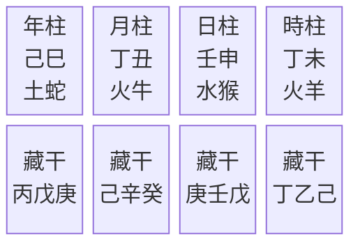
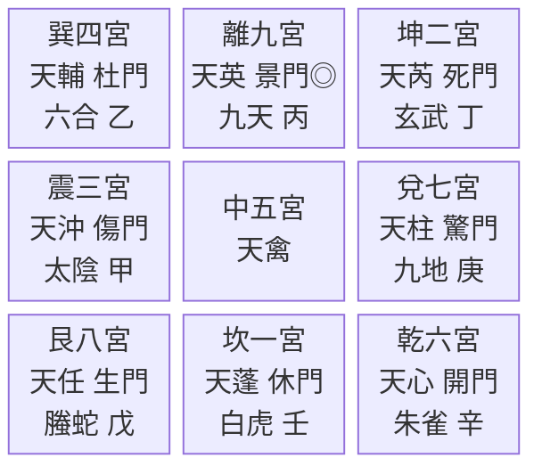
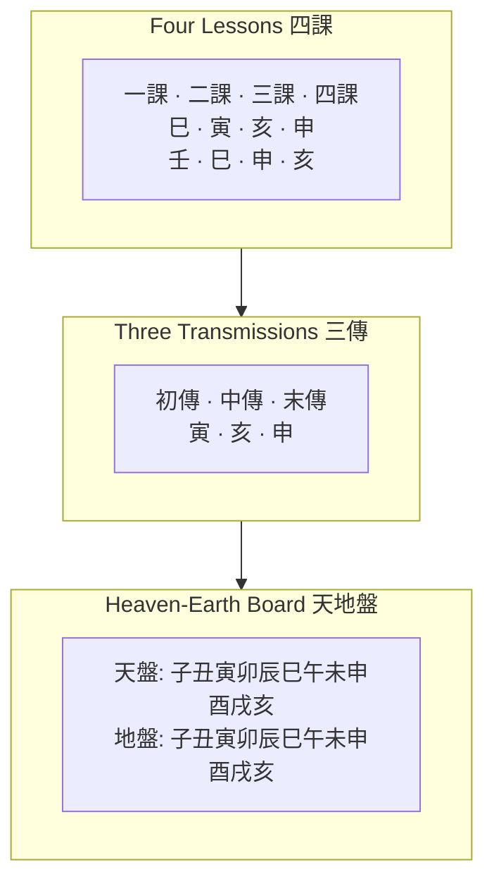
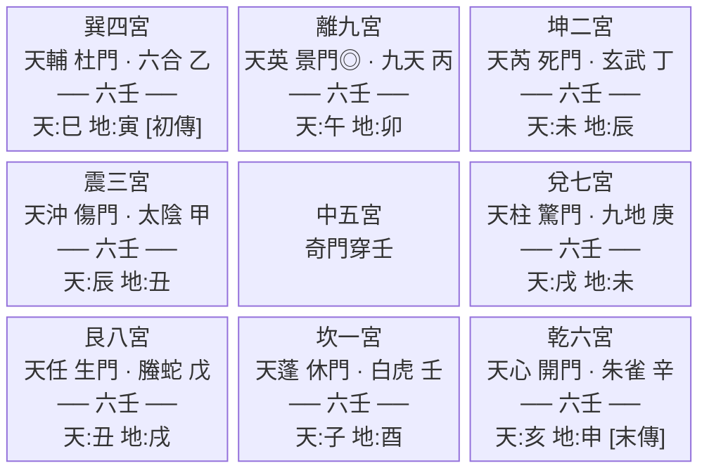
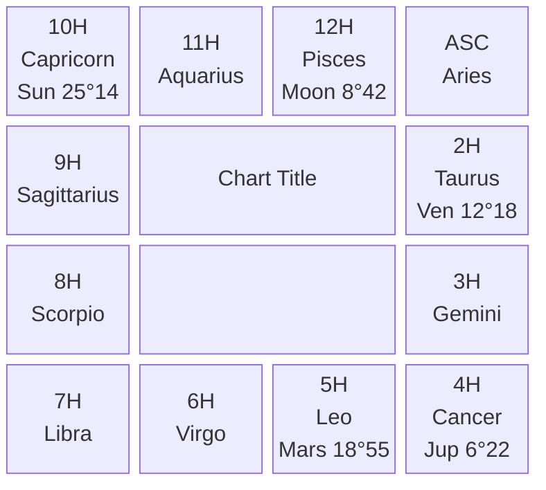

# Planetary Ephemeris, Astrology Systems, and CLI

**Date**: 2026-03-22
**Status**: Draft

---

## Overview

> **Scope**: This document is a *design overview* covering architecture, APIs, and build order across the full project. Each of the 7 phases listed in "Build Order" will produce its own detailed implementation spec through a separate brainstorm → spec → plan → TDD cycle.

Extend stem-branch from a solar-term-focused Chinese calendar library into a comprehensive multi-tradition astronomical computation engine with a terminal-based CLI. Three work streams:

1. **Planetary Ephemeris Extension** -- VSOP87D for all planets + ELP/MPP02 for Moon + DE441 corrections
2. **Astrology Systems** -- Seven Governors, Tropical, Sidereal, plus CLI rendering of existing divination systems
3. **CLI** -- `npx` command with ASCII chart rendering for all systems

---

## Sub-project A: Planetary Ephemeris Extension

### Architecture

New modules in `src/`:

```
src/
  planets/
    vsop87d-mercury.ts       # VSOP87D coefficients [A,B,C] arrays
    vsop87d-venus.ts
    vsop87d-mars.ts
    vsop87d-jupiter.ts
    vsop87d-saturn.ts
    vsop87d-uranus.ts
    vsop87d-neptune.ts
    de441-corrections.ts     # Even polynomial corrections per planet
    geocentric.ts            # Heliocentric -> geocentric for any planet
    planets.ts               # Public API: getPlanetPosition(planet, jde)
  moon/
    elp-mpp02.ts             # ELP/MPP02 evaluation engine
    elp-mpp02-data.ts        # Coefficient arrays (largest file)
    moon.ts                  # Public API: getMoonPosition(jde)
  pluto/
    pluto.ts                 # TOP2013 excerpt (Meeus Ch. 37 only valid ~1885-2099, cannot meet accuracy targets across 209-2493 CE)
```

### Public API

```typescript
getPlanetPosition(planet: Planet, date: Date): GeocentricPosition
getMoonPosition(date: Date): GeocentricPosition

type Planet = 'mercury' | 'venus' | 'mars' | 'jupiter' | 'saturn'
            | 'uranus' | 'neptune' | 'pluto'

interface GeocentricPosition {
  longitude: number   // apparent ecliptic longitude (degrees)
  latitude: number    // apparent ecliptic latitude (degrees)
  distance: number    // distance in AU (km for Moon)
  ra: number          // apparent right ascension (degrees)
  dec: number         // apparent declination (degrees)
}
```

### Computation Pipeline

Same as existing Earth/Sun computation, generalized:

1. VSOP87D heliocentric coordinates for target planet
2. VSOP87D heliocentric coordinates for Earth (existing)
3. Geometric geocentric conversion (planet - Earth)
4. Light-time correction (iterative)
5. Aberration correction
6. IAU2000B nutation
7. DE441 even polynomial correction per planet
8. Delta-T conversion to UT

### Data Generation

One-time scripts:

- `scripts/generate-vsop87d-planets.mjs` -- downloads CDS VSOP87D coefficient files, generates TypeScript arrays
- `scripts/fit-de441-planet-corrections.mjs` -- queries JPL Horizons for each planet, fits even polynomial corrections via least-squares
- `scripts/generate-elp-mpp02.mjs` -- generates ELP/MPP02 coefficient arrays (based on ytliu0's JavaScript implementation)

---

## Sub-project B: Astrology Systems

### B1. Seven Governors Four Remainders (七政四餘)

Uses planetary positions from Sub-project A.

- **Seven Governors** (七政): Sun, Moon, Mercury, Venus, Mars, Jupiter, Saturn -- geocentric ecliptic positions mapped to 28 lunar mansions (宿) and 12 palaces (宮)
- **Four Remainders** (四餘): Purple Qi (紫氣), Lunar Apogee (月孛), Rahu/North Node (羅睺), Ketu/South Node (計都) -- formulaic oscillating points from Moon's orbital elements
- **Chart**: 12 palaces, planetary placements, aspects, star spirits (神煞)
- **Module**: `src/seven-governors.ts`

### B2. Tropical Astrology

Builds on same planetary positions:

- **Zodiac**: Tropical (ecliptic longitude from vernal equinox, 12 x 30 deg)
- **House systems**: Placidus, Koch, Equal, Whole Sign (require local sidereal time + obliquity)
- **Aspects**: Conjunction (0 deg), opposition (180 deg), trine (120 deg), square (90 deg), sextile (60 deg) with configurable orbs
- **Planetary dignities**: Rulership, exaltation, detriment, fall per sign
- **Module**: `src/tropical-astrology.ts`

### B3. Sidereal Astrology (Jyotish)

Builds on Tropical with sidereal frame:

- **Ayanamsa**: Lahiri standard (~24 deg 07' in 2024, precessing ~50.3"/year). Formula: tropical longitude - ayanamsa = sidereal longitude
- **Nakshatras**: 27 lunar mansions (each 13 deg 20' sidereal longitude)
- **Dashas**: Vimshottari dasha system -- 120-year planetary period sequence, start determined by Moon's nakshatra at birth
- **Divisional charts**: D-1 (Rasi), D-9 (Navamsa), D-10 (Dasamsa) at minimum
- **Module**: `src/sidereal-astrology.ts`

### B4. Strange Gates Threading Six Waters (奇門穿壬)

Composite layer over existing 奇門遁甲 and 大六壬:

- Maps each 六壬 天地盤 branch onto corresponding 九宮 palace
- Marks 三傳 positions in the grid
- Highlights 奇門 格局 coinciding with 六壬 三傳
- Flags 八門 and 十二天將 co-located in same palace
- **Module**: `src/divination/qimen-chuanren.ts` (thin composition layer, no new astronomy)

### B5. Flying Stars (紫白飛星)

Year, month, day, and hour flying star charts:

- 3x3 Lo Shu grid with nine stars rotating through nine palaces
- Four grids (year/month/day/hour) rendered horizontally
- **Module**: `src/flying-stars.ts` (may already be partially implemented in almanac)

---

## Sub-project C: CLI

### Entry Point

`src/cli.ts` -- separate tsup build target to `dist/cli.cjs`.

`package.json` additions:
```json
{
  "bin": {
    "stem-branch": "./dist/cli.cjs"
  }
}
```

### CLI Interface

```
npx @4n6h4x0r/stem-branch [options]

Options:
  --date <datetime>        Birth date/time (default: now)
  --tz <timezone>          IANA timezone (default: system)
  --city <name>            City name for true solar time (resolves via embedded 143-city database in src/tz-data.ts; if not found, lists closest matches and exits with error)
  --lat <degrees>          Latitude for house computation (overrides --city latitude)
  --lng <degrees>          Longitude for true solar time (overrides --city longitude; required if --city not provided and chart needs coordinates)

Charts:
  --pillars                Four Pillars (四柱八字)
  --almanac                Daily almanac (建除, 宜忌, flying stars)
  --flying-stars           Flying Stars (紫白飛星) year/month/day/hour
  --polaris                Polaris Numerology (紫微斗數)
  --strange-gates          Strange Gates Escaping Technique (奇門遁甲)
  --six-waters             Six Positive Waters Divine Lessons (大六壬神課)
  --threading              Strange Gates Threading Six Waters (奇門穿壬)
  --seven-governors        Seven Governors Four Remainders (七政四餘)
  --tropical               Tropical Astrology
  --sidereal               Sidereal Astrology (Jyotish)
  --all                    All of the above

Output:
  --json                   JSON output instead of ASCII
  --lang <zh|en>           Language (default: zh)
```

Default (no chart flags): `--pillars --almanac`.

### Chart Layouts

#### Four Pillars (四柱八字)



日主: 壬水 · 納音: 劍鋒金

#### Polaris Numerology (紫微斗數) -- 4x3 grid

```mermaid
block-beta
  columns 4
  si["巳<br/>天機<br/>兄弟宮"] wu["午<br/>紫微<br/>命宮"] wei["未<br/> <br/>父母宮"] shen["申<br/>天府<br/>福德宮"]
  chen["辰<br/>太陽<br/>夫妻宮"] center["紫微斗數命盤"]:2 you["酉<br/>太陰<br/>田宅宮"]
  mao["卯<br/>武曲<br/>子女宮"] space[" "]:2 xu["戌<br/> <br/>官祿宮"]
  yin["寅<br/>天同<br/>財帛宮"] chou["丑<br/>廉貞<br/>疾厄宮"] zi["子<br/>巨門<br/>遷移宮"] hai["亥<br/>貪狼<br/>交友宮"]
```

#### Strange Gates (奇門遁甲) -- 3x3 grid



陽遁七局 · 甲子戊 · 值符:天心 · 值使:開門

#### Six Waters (大六壬神課)



#### Strange Gates Threading Six Waters (奇門穿壬) -- 3x3 with overlay



奇門: 陽遁七局 值符:天心 值使:開門
六壬: 四課(壬巳/巳寅/申亥/亥申) 三傳(寅→亥→申)

#### Flying Stars (紫白飛星) -- 4 grids horizontal

| | Year 年盤 | Month 月盤 | Day 日盤 | Hour 時盤 |
|---|---|---|---|---|
| **Row 1** | 五 · 一 · 三 | 二 · 七 · 九 | 九 · 五 · 七 | 三 · 八 · 一 |
| **Row 2** | 四 · 六 · 八 | 一 · 三 · 五 | 八 · 一 · 三 | 二 · 四 · 六 |
| **Row 3** | 九 · 二 · 七 | 六 · 八 · 四 | 四 · 六 · 二 | 七 · 九 · 五 |
| **入中** | 六白 | 三碧 | 一白 | 四綠 |

#### Tropical / Sidereal / Seven Governors -- shared 4x3 grid



Seven Governors uses Chinese mansion names; Sidereal uses Sanskrit nakshatra names + dasha timeline below.

### Output Headers

```
═══ Four Pillars 四柱八字 ═════════════════════════
═══ Almanac 建除 ══════════════════════════════════
═══ Flying Stars 紫白飛星 ═════════════════════════
═══ Polaris Numerology 紫微斗數 ═══════════════════
═══ Strange Gates 奇門遁甲 ═════════════════════════
═══ Six Waters 大六壬神課 ═════════════════════════
═══ Strange Gates Threading Six Waters 奇門穿壬 ═══
═══ Seven Governors 七政四餘 ═══════════════════════
═══ Tropical Astrology ════════════════════════════
═══ Sidereal Astrology ज्योतिष ════════════════════
```

### ASCII Rendering Module

`src/cli/ascii-grid.ts` -- shared utility:

- `renderGrid(cells: Cell[][], options)` -- takes NxM cell matrix, handles box drawing, padding, CJK character width detection
- Supports 4x3 (12-cell) and 3x3 (9-cell) layouts
- Handles center panel for chart metadata
- CJK-aware column alignment (double-width characters)

---

## Sub-project D: Validation Framework

### Four-Way Comparison Matrix

| Reference | Method | Role |
|---|---|---|
| **stem-branch** | VSOP87D + DE441 correction + ELP/MPP02 + IAU2000B | System under test |
| **sxwnl** | VSOP87D + DE405 correction | Analytical cross-check |
| **JPL Horizons** | DE441 numerical integration | Ground truth |
| **Swiss Ephemeris (WASM)** | VSOP87 + compressed DE431 differences | Independent high-precision reference |

### What Gets Compared

| Quantity | Bodies | Range | Resolution |
|---|---|---|---|
| Geocentric ecliptic longitude | Sun, Moon, Mercury-Pluto | 209-2493 CE | Sampled years (same 42 as solar terms) |
| Geocentric ecliptic latitude | Same | Same | Same |
| Solar term timing | Sun only | Same | All 24 terms/year |
| Lunar phase timing | Moon only | 1900-2100 | All new/full moons |

### Validation Scripts

```
scripts/
  fit-de441-planet-corrections.mjs     # Fits correction polynomials per planet
  4way-planet-comparison.mjs    # Runs the full comparison matrix
  sweph-reference.mjs           # Generates Swiss Ephemeris reference via WASM
```

### Test Thresholds (stem-branch vs JPL)

| Body | Target mean |delta| | Target max |delta| |
|---|---|---|
| Sun | < 1.5" (~1.5s timing) | < 4" |
| Moon | < 5" (~10s timing) | < 15" |
| Mercury-Saturn | < 2" | < 5" |
| Uranus, Neptune | < 3" | < 8" |
| Pluto | < 10" | < 30" |

### CI Integration

- Swiss Ephemeris WASM reference data pre-generated and committed as JSON fixtures
- Tests in `tests/planet-validation.test.ts`
- `docs/accuracy.md` extended with "Planetary Positions" section

---

## Build Order

Each phase gets its own detailed brainstorm → spec → plan → TDD cycle. The sections above define architecture and interfaces; the per-phase specs will define exact file contents, test cases, and implementation steps:

1. **Phase 1: Planetary Ephemeris** -- VSOP87D for Mercury-Neptune + ELP/MPP02 for Moon + Pluto + DE441 corrections + validation framework
2. **Phase 2: Seven Governors** (七政四餘) -- uses Phase 1 planetary positions
3. **Phase 3: Tropical Astrology** -- houses, aspects, dignities
4. **Phase 4: Sidereal Astrology** -- ayanamsa, nakshatras, dashas, vargas
5. **Phase 5: Strange Gates Threading Six Waters** (奇門穿壬) -- composition of existing systems
6. **Phase 6: Flying Stars** (紫白飛星) -- year/month/day/hour grids
7. **Phase 7: CLI** -- argument parsing, ASCII rendering, all chart types

---

## Non-Goals

- No GUI or web frontend (CLI only for this spec)
- No chart interpretation or fortune-telling text
- No user accounts or data persistence
- No localization beyond zh/en
